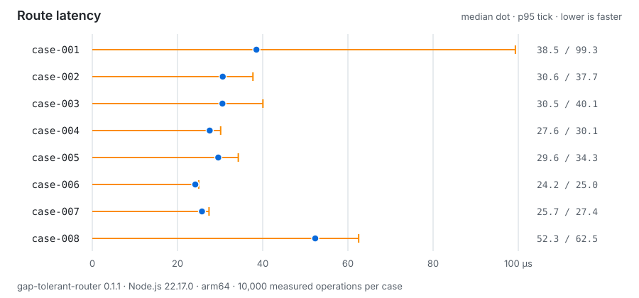

# Reference benchmark

This document records one local benchmark run of `gap-tolerant-router`, along
with the method used to produce it. It exists so the numbers can be interpreted,
not as a performance guarantee. Timings depend on hardware, operating system,
and Node.js version, and will differ on other machines. Treat the figures as a
single reference point, and re-measure in your own environment before relying on
any of them.

## Dataset

The measurements use a fully synthetic, deterministic fixture built from a fixed
generator seed (`synthetic-planar-set-v1`). It is not production data, derived
data, or anonymized real data. The fixture pairs a clean network with an
imperfect network that introduces the defects each case exercises:

- clean network: 73 nodes, 75 segments;
- imperfect network: 74 nodes, 72 segments;
- 8 route cases.

The eight cases and their expected outcomes are summarized in the
[reference scenarios](../README.md#reference-scenarios) section of the README.

## Package version

- `gap-tolerant-router@0.1.1`

## Verification

All eight cases produced their expected outcome: **8 of 8 expected outcomes
matched**. Each case was checked against its expected route length (or
`no-route`) and its expected repair or guard before timings were recorded.

## Construction timing

Time to build a router from the input, per network.

| Network | Median (µs) | p95 (µs) |
| --- | ---: | ---: |
| Clean | 275.635 | 496.010 |
| Imperfect | 265.981 | 293.025 |

## Route timing

Time to answer a single route query, per case.

| Case | Median (µs) | p95 (µs) | Throughput (ops/s) |
| --- | ---: | ---: | ---: |
| case-001 | 38.527 | 99.315 | 19,601.0 |
| case-002 | 30.614 | 37.708 | 31,633.0 |
| case-003 | 30.545 | 40.055 | 31,485.3 |
| case-004 | 27.559 | 30.129 | 36,120.9 |
| case-005 | 29.568 | 34.271 | 33,052.1 |
| case-006 | 24.175 | 24.984 | 41,352.0 |
| case-007 | 25.746 | 27.398 | 38,586.7 |
| case-008 | 52.333 | 62.527 | 18,475.0 |

## Method

- A warm-up pass runs before the measured batches.
- 25 measured batches are collected.
- Construction: 20 operations per batch, 500 measured operations per network.
- Routes: 400 operations per batch, 10,000 measured operations per case.
- Reported values are per-operation times in microseconds; throughput is the
  total measured operations divided by the aggregate elapsed time across all
  measured batches.

## Runtime context

- Node.js `v22.17.0`
- Darwin, arm64

## Interpretation

Within this run, construction of both networks stays in the low hundreds of
microseconds, and each single-case query resolves in tens of microseconds. In
this run, case-008 has the highest median and case-001 has the highest p95. This
is a small, local microbenchmark and does not isolate causes, so no causal
inference should be drawn from those differences. These figures come from one
machine and one dataset of this size; they are not representative of larger
networks or of other environments, and should be re-measured for your own
workload.
